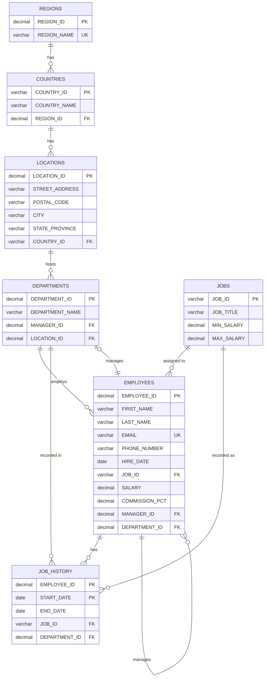

```mermaid
erDiagram
    REGIONS ||--o{ COUNTRIES : "has"
    COUNTRIES ||--o{ LOCATIONS : "has"
    LOCATIONS ||--o{ DEPARTMENTS : "hosts"
    DEPARTMENTS ||--o{ EMPLOYEES : "employs"
    DEPARTMENTS ||--o{ JOB_HISTORY : "recorded in"
    EMPLOYEES ||--o{ JOB_HISTORY : "has"
    EMPLOYEES ||--o{ EMPLOYEES : "manages"
    EMPLOYEES ||--o| DEPARTMENTS : "manages"
    JOBS ||--o{ EMPLOYEES : "assigned to"
    JOBS ||--o{ JOB_HISTORY : "recorded as"

    REGIONS {
        decimal REGION_ID PK
        varchar REGION_NAME UK
    }

    COUNTRIES {
        varchar COUNTRY_ID PK
        varchar COUNTRY_NAME
        decimal REGION_ID FK
    }

    LOCATIONS {
        decimal LOCATION_ID PK
        varchar STREET_ADDRESS
        varchar POSTAL_CODE
        varchar CITY
        varchar STATE_PROVINCE
        varchar COUNTRY_ID FK
    }

    DEPARTMENTS {
        decimal DEPARTMENT_ID PK
        varchar DEPARTMENT_NAME
        decimal MANAGER_ID FK
        decimal LOCATION_ID FK
    }

    EMPLOYEES {
        decimal EMPLOYEE_ID PK
        varchar FIRST_NAME
        varchar LAST_NAME
        varchar EMAIL UK
        varchar PHONE_NUMBER
        date HIRE_DATE
        varchar JOB_ID FK
        decimal SALARY
        decimal COMMISSION_PCT
        decimal MANAGER_ID FK
        decimal DEPARTMENT_ID FK
    }

    JOB_HISTORY {
        decimal EMPLOYEE_ID PK
        date START_DATE PK
        date END_DATE
        varchar JOB_ID FK
        decimal DEPARTMENT_ID FK
    }

    JOBS {
        varchar JOB_ID PK
        varchar JOB_TITLE
        decimal MIN_SALARY
        decimal MAX_SALARY
    }
```